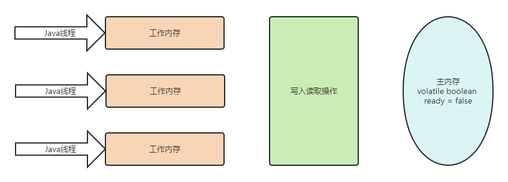

# 并发编程原理 #
## 什么是并发编程 ##
+ 什么是并发编程  
  并发历史:   
  早期计算机---从头到尾执行一个程序，资源浪费  
  操作系统出现--计算机能运行多个程序，不同的程序在不同的单独的进程中运行
+ 串行与并行的区别  
  串行：洗茶具、打水、烧水、等水开、冲茶  
  并行：打水、烧水同时洗茶具、水开、冲茶  
  好处：可以缩短整个流程的时间
+ 并发编程目的  
  摩尔定律：当价格不变时，集成电路上可容纳的元器件的数目，约每隔18-24个月便会增加一倍，性能也将提升一倍。这一定律揭示了信息技术进步的速度。 让程序充分利用计算机资源 加快程序响应速度（耗时任务、web服务器） 简化异步事件的处理
+ 什么时候适合使用并发编程  
  任务会阻塞线程，导致之后的代码不能执行：比如一边从文件中读取，一边进行大量计算的情况。  
  任务执行时间过长，可以划分为分工明确的子任务：比如分段下载任务间断性执行：日志打印任务本身需要协作执行：
  比如生产者消费者问题

**并发和并行的区别**
> **并发** concurrency：
⼀台处理器上同时处理任务, 这个同时实际上是交替处理多个任务，程序中可以同时拥有两个或者多
个线程，当有多个线程在操作时,如果系统只有⼀个CPU,则它根本不可能真正同时进⾏⼀个以上的线
程,它只能把CPU运⾏时间划分成若⼲个时间段,再将时间段分配给各个线程执⾏
>
> **并⾏** parallelism：
多个CPU上同时处理多个任务，⼀个CPU执⾏⼀个进程时，另⼀个CPU可以执⾏另⼀个进
程，两个进程互不抢占CPU资源，可以同时进⾏
> 并发指在⼀段时间内宏观上去处理多个任务。 并⾏指同⼀个时刻，多个任务确实真的同时运⾏。
>
> 例⼦：  
并发是⼀⼼多⽤，听课和看电影，但是CPU⼤脑只有⼀个，所以轮着来  
并⾏：⽕影忍者中的影分身，有多个你出现，可以分别做不同的事情
>
> ⼀个项⽬经理A和3个程序B C D的故事  
> 并发：A给B讲完需求，B⾃⼰去实现，期间A继续给C和D讲，不⽤等待某个程序员去完成，期间项⽬经理没空闲下来  
并⾏：直接找3个项⽬经理分别分配给3个程序员

## 线程、进程、协程的区别 ##
> **进程**: 本质上是⼀个独⽴执⾏的程序，进程是操作系统进⾏资源分配和调度的基本概念，操作系统进⾏资源分配和调度的⼀个独⽴单位
>
> **线程**:是操作系统能够进⾏运算调度的最⼩单位。它被包含在进程之中，是进程中的实际运作单位。⼀个进程中可以并发多个线程，每条线程执⾏不同的任务，切换受系统控制。
>
> **协程**: ⼜称为微线程，是⼀种⽤户态的轻量级线程，协程不像线程和进程需要进⾏系统内核上的上下⽂切换，协程的上下⽂切换是由⽤户⾃⼰决定的，有⾃⼰的上下⽂，所以说是轻量级的线程，也称之
为⽤户级别的线程就叫协程，⼀个线程可以多个协程,线程进程都是同步机制，⽽协程则是异步
Java的原⽣语法中并没有实现协程,⽬前python、Lua和GO等语⾔⽀持
>
> 关系：⼀个进程可以有多个线程，它允许计算机同时运⾏两个或多个程序。线程是进程的最⼩执⾏单位，CPU的调度切换的是进程和线程，进程和线程多了之后调度会消耗⼤量的CPU，CPU上真正运⾏的是线程，线程可以对应多个协程

## 线程的状态以及相互转化 ##
JAVA线程常见的基本状态
> JDK的线程状态分6种，JVM⾥⾯9种，我们⼀般说JDK的线程状态
>
> 常⻅的5种状态
>
> **创建(NEW)**：⽣成线程对象，但是并没有调⽤该对象start(), new Thread()
>
> **就绪(Runnable)**：当调⽤线程对象的start()⽅法，线程就进⼊就绪状态，但是此刻线程调度还没把该线程设置为当前线程，就是没获得CPU使⽤权。  
> 如果线程运⾏后，从等待或者睡眠中回来之后，也会进⼊就绪状态。  
> 注意:有些⽂档把就绪和运⾏两种状态统⼀称为 “运⾏中”
>
> **运⾏(Running)**：程序将处于就绪状态的线程设置为当前线程，即获得CPU使⽤权，这个时候线程进⼊运⾏状态，开始运⾏run⾥⾯的逻辑
>
> **阻塞(Blocked)**  
等待阻塞：进⼊该状态的线程需要等待其他线程作出⼀定动作(通知或中断)，这种状态的
话CPU不会分配过来，他们需要被唤醒，可能也会⽆限等待下去。⽐如调⽤wait(状态就会变成
WAITING状态)，也可能通过调⽤sleep(状态就会变成TIMED_WAITING), join或者发出IO请
求，阻塞结束后线程重新进⼊就绪状态
>
> 同步阻塞：线程在获取synchronized同步锁失败，即锁被其他线程占⽤，它就会进⼊同步阻塞状态  
备注：相关资料会⽤细分下⾯的状态  
**等待(WAITING)**：进⼊该状态的线程需要等待其他线程做出⼀些特定动作（通知或中断）。  
**超时等待(TIMED_WAITING)**：该状态不同于WAITING，它可以在指定的时间后⾃⾏返回
>
> **死亡(TERMINATED)**:⼀个线程run⽅法执⾏结束，该线程就死亡了，不能进⼊就绪状态  

## volatile和synchronized ##
**volatile:**
+ 能且仅能修饰变量
+ 保证该变量的可见性，volatile关键字仅仅保证可见性，并不保证原子性
+ 禁止指令重排序
+ A、B两个线程同时读取volatile关键字修饰的对象，A读取之后，修改了变量的值,修改后的值，对B线程来说，是可见的
+ 使用场景 1：作为线程开关 2：单例，修饰对象实例，禁止指令重排序

**synchronized**
+ 内置锁  
  每个java对象都可以用做一个实现同步的锁，这些锁称为内置锁。线程进入同步代码块或方法的时候会自动获
  得该锁，在退出同步代码块或方法时会释放该锁。获得内置锁的唯一途径就是进入这个锁的保护的同步代码块
  或方法。
+ 互斥锁  
  内置锁是一个互斥锁，这就是意味着最多只有一个线程能够获得该锁，当线程A尝试去获得线程B持有的内置
  锁时，线程A必须等待或者阻塞，直到线程B释放这个锁，如果B线程不释放这个锁，那么A线程将永远等待下
  去。
+ 修饰普通方法：锁住对象的实例
+ 修饰静态方法：锁住整个类
+ 修饰代码块： 锁住一个对象 synchronized (lock) 即synchronized后面括号里的内容

**volatile和synchronized的区别**
> volatile是轻量级的synchronized，保证了共享变量的可⻅性，被volatile关键字修饰的变量，如果值发⽣了变化，其他线程⽴刻可⻅，避免出现脏读现象
>
> volatile：保证可⻅性，但是不能保证原⼦性  
> synchronized：保证可⻅性，也保证原⼦性
>
> volatile使⽤场景  
1、不能修饰写⼊操作依赖当前值的变量，⽐如num++、num=num+1,不是原⼦操作，⾁眼看起来是，但是JVM字节码层⾯不⽌⼀步 demo -> [UnSafeThreadDemo](UnSafeThreadDemo.java)  
2、由于禁⽌了指令重排，所以JVM相关的优化没了，效率会偏弱
>
>
>
> _拓展_
> > (先行发生原则happens-before)
> > + 判断数据是有有竞争、线程是否安全的主要依据
> > 1. 程序次序规则：同一个线程内，按照代码出现的顺序，前面的代码先行于后面的代码，准确的说是控制流顺序，因为要考虑到分支和循环结构。
> > 2. 管程锁定规则：一个unlock操作先行发生于后面（时间上）对同一个锁的lock操作。
> > 3. volatile变量规则：对一个volatile变量的写操作先行发生于后面（时间上）对这个变量的读操作
> > 4. 线程启动规则：Thread的start()方法先行发生于这个线程的每一个操作。
> > 5. 线程终止规则：线程的所有操作都先行于此线程的终止检测。可以通过Thread.join()方法结束、Thread.isAlive()的返回值等手段检测线程的终止。
> > 6. 线程中断规则：对线程interrupt()方法的调用先行发生于被中断线程的代码检测到中断事件的发生，可以通过Thread.interrupt()方法检测线程是否中断
> > 7. 对象终结规则：一个对象的初始化完成先行于发生它的finalize()方法的开始。
> > 8. 传递性：如果操作A先行于操作B，操作B先行于操作C，那么操作A先行于操作C。
> > + 为什么要有该原则？ 无论jvm或者cpu，都希望程序运行的更快。如果两个操作不在上面罗列出来的规则里面，那么久可以对他们进行任意的重排序。
> > + 时间先后顺序与先行发生的顺序之间基本没有太大的关系。
> >
> > (JDK对synchronized的优化)  
> > synchronized是解决线程安全的问题，常⽤在同步普通⽅法、静态⽅法、代码块中  
⾮公平、可重⼊  
每个对象有⼀个锁和⼀个等待队列，锁只能被⼀个线程持有，其他需要锁的线程需要阻塞等待。锁被释放后，对象会从队列中取出⼀个并唤醒，唤醒哪个线程是不确定的，不保证公平性  
两种形式：  
⽅法：⽣成的字节码⽂件中会多⼀个 **ACC_SYNCHRONIZED** 标志位，当⼀个线程访问⽅法时，会去检查是否存在 **ACC_SYNCHRONIZED** 标识，如果存在，执⾏线程将先获取monitor，获取成功之后才能执⾏⽅法体，⽅法执⾏完后再释放monitor。在⽅法执⾏期间，其他任何线程都⽆法再获得同⼀个monitor对象，也叫隐式同步  
代码块：加了 **synchronized** 关键字的代码段，⽣成的字节码⽂件会多出 **monitorenter** 和 **monitorexit** 两条指令，每个 **monitor** 维护着⼀个记录着拥有次数的计数器, 未被拥有的monitor的该计数器为0，当⼀个线程获执⾏monitorenter后，该计数器⾃增1;
> 当同⼀个线程执⾏ **monitorexit** 指令的时候，计数器再⾃减1。当计数器为0的时候, **monitor** 将被释放.也叫显式同步  
两种本质上没有区别，底层都是通过 **monitor** 来实现同步, 只是⽅法的同步是⼀种隐式的⽅式来实现，⽆需通过字节码来完成 [SynchronizedDemo](SynchronizedDemo.java)
 
> > jdk的优化原理:  
> > 有得到锁的资源进⼊Block状态,涉及到操作系统⽤户模式和内核模式的切换，代价⽐较⾼  
jdk6进⾏了优化，增加了从偏向锁到轻量级锁再到重量级锁的过渡，但是在最终转变为重量级锁之后，性能仍然较低 

## 并发编程三要素 ##
> **原⼦性**:⼀个不可再被分割的颗粒，原⼦性指的是⼀个或多个操作要么全部执⾏成功要么全部执⾏失败，期间不能被中断，也不存在上下⽂切换，线程切换会带来原⼦性的问题
> int num = 1; // 原⼦操作  
> num++; // ⾮原⼦操作，从主内存读取num到线程⼯作内存，进⾏ +1，再把num写到主内存, 除⾮⽤原⼦类，即java.util.concurrent.atomic⾥的原⼦变量类
>
> 解决办法是可以⽤synchronized或Lock(⽐如ReentrantLock)来把这个多步操作“变成”原⼦操作，但是volatile，前⾯有说到不能修饰有依赖值的情况 [SafeThreadDemo](SafeThreadDemo.java)  
> 解决核⼼思想：把⼀个⽅法或者代码块看做⼀个整体，保证是⼀个不可分割的整体
>  
>  
> **有序性**:程序执⾏的顺序按照代码的先后顺序执⾏，因为处理器可能会对指令进⾏重排序JVM在编译java代码或者CPU执⾏JVM字节码时，对现有的指令进⾏重新排序，主要⽬的是优化运⾏效率(不改变程序结果的前提)  
> int a = 3  ①  
int b = 4  ②  
int c = 5  ③  
int h = a * b * c  ④  
>  
上⾯的例⼦ 执⾏顺序1,2,3,4 和 2,1,3,4 结果都是⼀样，指令重排序可以提⾼执⾏效率，但是多线程上可能会影响结果  
> 假如下⾯的场景，正常是顺序处理  
//线程1  
//处理初始化⼯作，处理完成后才可以正式运⾏下⾯的run⽅法  
before();  
//标记资源处理好了，如果资源没处理好，此时程序就可能出现问题  
flag = true;  
//线程2  
while (flag) {  
    // 核⼼业务代码  
    run();  
}  
// 指令重排序后，导致顺序换了，程序出现问题，且难排查  
//线程1    
//标记资源处理好了，如果资源没处理好，此时程序就可能出现问题    
flag = true;  
//线程2  
while (flag) {  
    //核⼼业务代码    
    run();  
}  
//处理初始化⼯作，处理完成后才可以正式运⾏下⾯的run⽅法    
before();  
>  
> **可⻅性**: ⼀个线程A对共享变量的修改,另⼀个线程B能够⽴刻看到  
// 线程 A 执⾏  
int num = 0;  
// 线程 A 执⾏  
num++;  
// 线程 B 执⾏  
System.out.print("num的值：" + num);  
线程A执⾏ i++ 后再执⾏线程 B，线程 B可能有2个结果，可能是0和1。  
因为i++在线程A中执⾏运算，并没有⽴刻更新到主内存当中，⽽线程B就去主内存当中读取并打印，此时打印的就是0；也可能线程A执⾏完成更新到主内存了,线程B的值是1。  
所以需要保证线程的可⻅性  
synchronized、lock和volatile能够保证线程可⻅性

**为什么会出现脏读?**
> JAVA内存模型简称 JMM  
JMM规定所有的变量存在在主内存，每个线程有⾃⼰的⼯作内存,线程对变量的操作都在⼯作内存中进⾏，不能直接对主内存就⾏操作
>
> 使⽤volatile修饰变量  
每次读取前必须从主内存属性最新的值  
每次写⼊需要⽴刻写到主内存中
>
> volatile关键字修修饰的变量随时看到的⾃⼰的最新值，假如线程1对变量v进⾏修改，那么线程2是可以⻢上看⻅ [VolatileVisibilityDemo](VolatileVisibilityDemo.java)

## 常见的调度算法 ##
  
**进程间调度算法**
> 先来先服务调度算法：  
按照作业/进程到达的先后顺序进⾏调度，即：优先考虑在系统中等待时间最⻓的作业  
排在⻓进程后的短进程的等待时间⻓，不利于短作业/进程  
 
短作业优先调度算法：  
短进程/作业（要求服务时间最短）在实际情况中占有很⼤⽐例，为了使得它们优先执⾏  
对⻓作业不友好  
 
⾼响应⽐优先调度算法:  
在每次调度时，先计算各个作业的优先权：优先权 = 响应⽐ =（等待时间+要求服务时间）/ 要求服务时间，  
因为等待时间与服务时间之和就是系统对该作业的响应时间，所以优先权=响应⽐=响应时间/要求服务时间，  
选择优先权⾼的进⾏服务需要计算优先权信息，增加了系统的开销  
 
时间⽚轮转调度算法:  
轮流的为各个进程服务，让每个进程在⼀定时间间隔内都可以得到响应，由于⾼频率的进程切换，会增加了开销，且不区分任务的紧急程度  
 
优先级调度算法:  
根据任务的紧急程度进⾏调度，⾼优先级的先处理，低优先级的慢处理  
如果⾼优先级任务很多且持续产⽣，那低优先级的就可能很慢才被处理

**线程间调度算法**
> 线程调度是指系统为线程分配CPU使⽤权的过程，主要分两种  
 
协同式线程调度(分时调度模式)：线程执⾏时间由线程本身来控制，线程把⾃⼰的⼯作执⾏完之后，要主动通知系统切换到另外⼀个线程上。  
最⼤好处是实现简单，且切换操作对线程⾃⼰是可知的，没啥线程同步问题。坏处是线程执⾏时间不可控制，如果⼀个线程有问题，可能⼀直阻塞在那⾥  
 
抢占式线程调度：每个线程将由系统来分配执⾏时间，线程的切换不由线程本身来决定（Java中，Thread.yield()可以让出执⾏时间，但⽆法获取执⾏时间）。  
线程执⾏时间系统可控，也不会有⼀个线程导致整个进程阻塞   
 
Java线程调度就是抢占式调度,优先让可运⾏池中优先级⾼的线程占⽤CPU,如果可运⾏池中的线程优先级相同,那就随机选择⼀个线程  
所以我们如果希望某些线程多分配⼀些时间，给⼀些线程少分配⼀些时间，可以通过设置线程优先级来完成。  
JAVA的线程的优先级，以1到10的整数指定。当多个线程可以运⾏时，VM⼀般会运⾏最⾼优先级的线
程（Thread.MIN_PRIORITY⾄Thread.MAX_PRIORITY）  
在两线程同时处于就绪runnable状态时，优先级越⾼的线程越容易被系统选择执⾏。但是优先级并不是100%可以获得，只不过是机会更⼤⽽已。  
 
有⼈会说，wait,notify不就是线程本身控制吗？  
其实不是，wait是可以让出执⾏时间，notify后⽆法获取执⾏时间，随机等待队列⾥⾯获取⽽已

## 锁 ##
**锁的类型**
> + 悲观锁：当线程去操作数据的时候，总认为别的线程会去修改数据，所以它每次拿数据的时候都会上锁，别的线程去拿数据的时候就会阻塞，⽐如synchronized
> + 乐观锁：每次去拿数据的时候都认为别⼈不会修改，更新的时候会判断是别⼈是否回去更新数据，通过版本来判断，如果数据被修改了就拒绝更新，  
    > ⽐如CAS是乐观锁，但严格来说并不是锁，通过原⼦性来保证数据的同步，⽐如说数据库的乐观锁，通过版本控制来实现，CAS不会保证线程同步，乐观的认为在数据更新期间没有其他线程影响  
     
    ⼩结：悲观锁适合写操作多的场景，乐观锁适合读操作多的场景，乐观锁的吞吐量会⽐悲观锁多  
     
> + 公平锁：指多个线程按照申请锁的顺序来获取锁，简单来说 如果⼀个线程组⾥，能保证每个线程都能拿到锁 ⽐如ReentrantLock(底层是同步队列FIFO:First Input First Output来实现)
> + ⾮公平锁：获取锁的⽅式是随机获取的，保证不了每个线程都能拿到锁，也就是存在有线程饿死,⼀直拿不到锁，⽐如synchronized、ReentrantLock  
     
    ⼩结：⾮公平锁性能⾼于公平锁，更能重复利⽤CPU的时间  
     
> + 可重⼊锁：也叫递归锁，在外层使⽤锁之后，在内层仍然可以使⽤，并且不发⽣死锁
> + 不可重⼊锁：若当前线程执⾏某个⽅法已经获取了该锁，那么在⽅法中尝试再次获取锁时，就会获取不到被阻塞  
     
    ⼩结：可重⼊锁能⼀定程度的避免死锁 synchronized、ReentrantLock 重⼊锁  
     
> + ⾃旋锁：⼀个线程在获取锁的时候，如果锁已经被其它线程获取，那么该线程将循环等待，然后不断的判断锁是否能够被成功获取，直到获取到锁才会退出循环,任何时刻最多只能有⼀个执⾏单元获得锁.  
     
    ⼩结：不会发⽣线程状态的切换，⼀直处于⽤户态，减少了线程上下⽂切换的消耗，缺点是循环会消耗CPU  
     
    常⻅的⾃旋锁：TicketLock,CLHLock,MSCLock
> + 共享锁：也叫S锁/读锁，能查看但⽆法修改和删除的⼀种数据锁，加锁后其它⽤户可以并发读取、查询数据，但不能修改，增加，删除数据，该锁可被多个线程所持有，⽤于资源数据共享
> + 互斥锁：也叫X锁/排它锁/写锁/独占锁/独享锁/ 该锁每⼀次只能被⼀个线程所持有,加锁后任何线程试图再次加锁的线程会被阻塞，直到当前线程解锁。  
    例⼦：如果 线程A 对 data1 加上排他锁后，则其他线程不能再对 data1 加任何类型的锁,获得互斥锁的线程即能读数据⼜能修改数据
> + 死锁：两个或两个以上的线程在执⾏过程中，由于竞争资源或者由于彼此通信⽽造成的⼀种阻塞的现象，若⽆外⼒作⽤，它们都将⽆法让程序进⾏下去 [DeadLockDemo](DeadLockDemo.java)  
>  
> **下⾯三种是Jvm为了提⾼锁的获取与释放效率⽽做的优化 针对Synchronized的锁升级，锁的状态是通过对象监视器在对象头中的字段来表明，是不可逆的过程**
> > + 偏向锁：⼀段同步代码⼀直被⼀个线程所访问，那么该线程会⾃动获取锁，获取锁的代价更低  
> > + 轻量级锁：当锁是偏向锁的时候，被其他线程访问，偏向锁就会升级为轻量级锁，其他线程会通过⾃旋的形式尝试获取锁，但不会阻塞，且性能会⾼点
> > + 重量级锁：当锁为轻量级锁的时候，其他线程虽然是⾃旋，但⾃旋不会⼀直循环下去，当⾃旋⼀定次数的时候且还没有获取到锁，就会进⼊阻塞，该锁升级为重量级锁，重量级锁会让其他申请的线程进⼊阻塞，性能也会降低  
> 
> 分段锁、⾏锁、表锁

## 高性能的CAS ##
+ 什么是**CAS**?
> 全称是Compare And Swap，即⽐较再交换，是实现并发应⽤到的⼀种技术底层通过Unsafe类实现原⼦性操作操作包含三个操作数 —— 内存地址（V）、预期原值（A）和新值(B)。  
如果内存位置的值与预期原值相匹配，那么处理器会⾃动将该位置值更新为新值，若果在第⼀轮循环中，a线程获取地址⾥⾯的值被b线程修改了，那么a线程需要⾃旋，到下次循环才有可能机会执⾏。  
CAS这个是属于乐观锁，性能较悲观锁有很⼤的提⾼   
AtomicXXX 等原⼦类底层就是CAS实现，⼀定程度⽐synchonized好，因为后者是悲观锁  

+ CAS性能虽好，但存在的**ABA**问题你知道吗
> CAS存在以下的问题  
> 1. 自旋时间长CPU利用率增加，CAS里面是一个循环判断的过程，如果线程一直没有获取到状态，CPU资源会一直被占用
> 2. 存在ABA问题
> > 如果⼀个变量V初次读取是A值，并且在准备赋值的时候也是A值，那就能说明A值没有被修改过吗？  
其实是不能的，因为变量V可能被其他线程改回A值，结果就是会导致CAS操作误认为从来没被修改过，从⽽赋值给V。  
 
解决方法：  
给变量加⼀个版本号即可，在⽐较的时候不仅要⽐较当前变量的值，还需要⽐较当前变量的版本号。  
在java5中，已经提供了AtomicStampedReference来解决问题，检查当前引⽤是否等于预期引⽤，其次检查当前标志是否等于预期标志，如果都相等就会以原⼦的⽅式将引⽤和标志都设置为新值
>
> 

## 并发编程核心底层AQS ##
+ 什么是AQS
> AQS的全称为（AbstractQueuedSynchronizer），这个类在java.util.concurrent.locks包下⾯。它是⼀个Java提供的底层同步⼯具类，⽐如CountDownLatch、ReentrantLock，
Semaphore，ReentrantReadWriteLock，SynchronousQueue，FutureTask等等皆是基于
AQS的
只要搞懂了AQS，那么J.U.C中绝⼤部分的api都能轻松掌握
简单来说：是⽤⼀个int类型的变量表示同步状态，并提供了⼀系列的CAS操作来管理这个同步状态
对象
⼀个是 state（⽤于计数器，类似gc的回收计数器）
⼀个是线程标记（当前线程是谁加锁的），
⼀个是阻塞队列（⽤于存放其他未拿到锁的线程)
例⼦：线程A调⽤了lock()⽅法，通过CAS将state赋值为1，然后将该锁标记为线程A加锁。如果线
程A还未释放锁时，线程B来请求，会查询锁标记的状态，因为当前的锁标记为 线程A，线程B未能匹
配上，所以线程B会加⼊阻塞队列，直到线程A触发了 unlock() ⽅法，这时线程B才有机会去拿到
锁，但是不⼀定肯定拿到